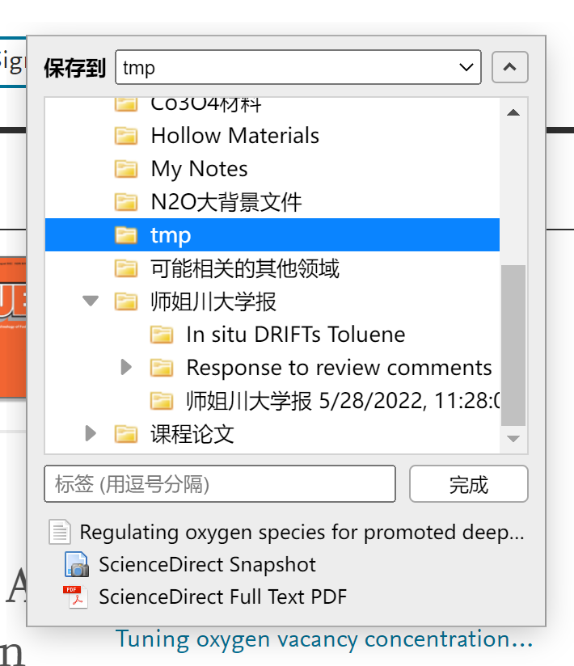
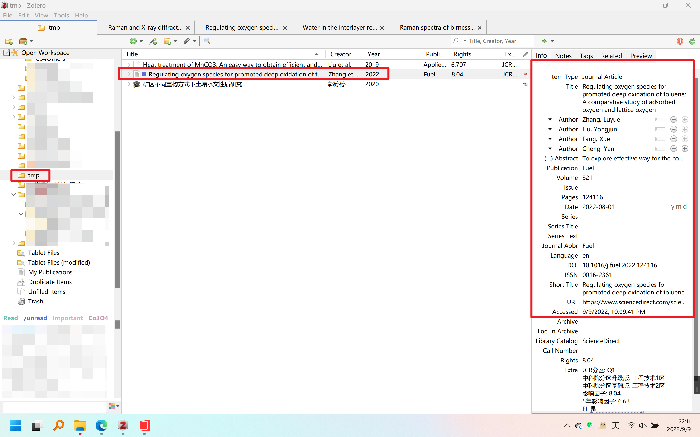
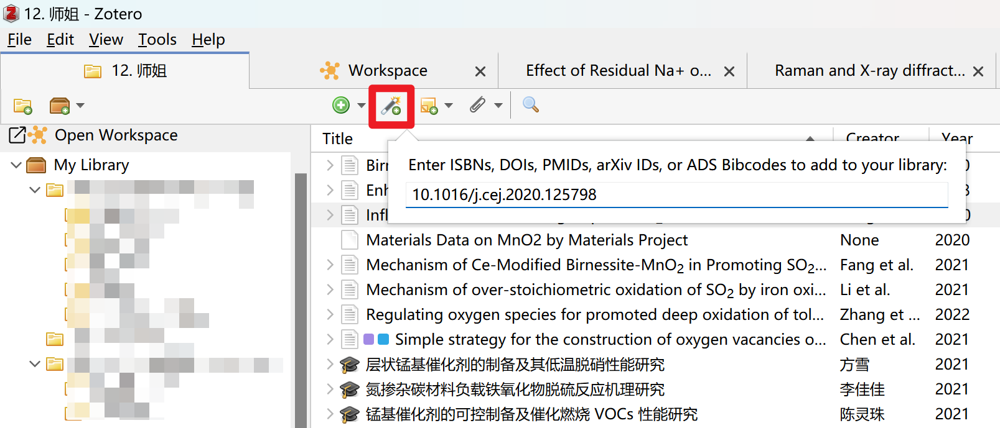

# 添加条目

本节描述了在 Zotero 中添加条目（例如书籍、期刊文章、网页等）的各种方法。要了解有关添加附件（例如 PDF 或图像）的更多信息，请参阅 [添加附件](./add-attachments.md) 页面。

## 条目与附件 _初级_

在使用 Zotero 之前，我希望可以引入几个术语：

### 条目 Item

Zotero 的基本文件单元，用来表示一篇论文、一本书等的题录信息，引用时使用的条目中储存的信息。下面是一些常见的条目类别：

|                       图标                       |   类型   |
| :----------------------------------------------: | :------: |
|                                                  |   默认   |
|  | 普通网页 |
|  | 期刊文章 |
|          | 会议论文 |
|    | 学位论文 |
|                  |   图书   |
|    | 多个项目 |

### 附件 Attachments

附件，通常是文件，例如论文的全文 PDF、支持材料等。常见的附件包括：

- PDF 附件 
- 笔记附件 
- 网页快照 

附件既可以作为独立项添加，也可以作为常规 Zotero 条目的子项添加。一般来说，文件当做条目的子项添加。当一篇文献只有附件而没有条目的时候是不能被成功引用的，而一篇文献有条目信息而没有附件时，并不影响正常的引用。

## 通过浏览器添加条目 _推荐_

::: tip

使用这种方法需要确保以安装浏览器插件 Zotero Connector。如未安装，请参考：[Zotero 下载与安装](install.md) 。

:::

通过浏览器添加条目是最方便的途径之一，也是 Zotero 的特色功能之一。

当所在的网页呈现出不同的内容类型时，Zotero Connector 会显示不同的图标（各种类别的图标见 [#条目-item](#条目-item)）。例如，如果打开的是一篇期刊文章，那么图标就会变成下图（红框圈出）。

点击该图标，将在网页右上角显示如下的对话框，选择保存的合集位置，添加标签，即可将网页对应的文献的元数据录入 Zotero ：

此时打开 Zotero，将会自动定位到保存时选择的合集：

::: tip

Connector 抓取中文文献能力依靠中文 Translator 支持，更新 Translator 请参考：
[如何更新 Translator](./faqs/update-translators.md)。

Connector 抓取文献错误解决：[从浏览器抓取条目时发生错误 / 抓取时不能自动下载 PDF / 无法自动给添加的 PDF 附件创建条目](https://zotero.yuque.com/staff-gkhviy/zotero/mribmi?view=doc_embed)

如果抓取失败且尝试了上述办法仍然不能解决，请手动下载 PDF 附件并通过附件添加条目。

:::

## 通过附件添加条目（推荐）

对于已有 PDF 文件的文献，可以通过将 PDF 文件拖拽到 Zotero 中来添加这篇文献的附件。添加附件后，Zotero 会自动通过 PDF 来识别文献 —— 英文文献通常通过识别 PDF 的元数据，中文文献则识别文件名（中文文献文件识别能力由 [茉莉花](./plugins/jasminum.md) 插件提供）。

::: note 小提示

不管是中文文献还是英文文献，都 **存在一定的概率无法成功匹配到信息并自动创建条目** 。如果遇到问题了，还是 **建议回到期刊官网的论文详情页抓取信息并创建条目** ，然后将 PDF 文件以附件的形式添加到该条目上（将附件拖到该条目上即可，但不要拖到条目之间的间隙里）。如果 Zotero 确实不支持抓取你正在使用的网站，你也可以采用后文的进阶方法创建条目。

如果您通过附件添加条目信息，建议您在添加后检查每一个条目的元数据。这一功能自动匹配的元数据可能存在错误，建议人工核对后再使用。

:::

### 英文文献附件自动识别

很多英文文献的 PDF 附件中带有论文的元数据，而 Zotero 也支持通过 PDF 附件中的元数据自动抓取文献信息并自动创建副条目。具体操作如下：

1. 从网页上下载好文献的 PDF 附件。

2. 将 PDF 附件 直接拖入 Zotero 文献列表中的空白区域。

   ::: details 列表种没有空白区域了怎么办？

   如果页面上没有空白区域了，可以 将附件拖到任意两个条目中间的间隙处 ，此时相邻条目间隙处会出现一个横线，如上图所示。请不要将附件直接拖到条目上，因为拖到条目上是另一个功能：将这一文件作为附件添加到该条目中。

   

   :::

3. 此时，界面右上角同步按钮旁会多显示一个图标，这意味着 Zotero 正在检索并匹配这一条目信息。

   

4. 匹配完成后，Zotero 会自动使用元数据创建父条目，并将这一 PDF 文件作为附件添加到新生成的条目中。

   

:::: details 重新抓取外文 PDF 元数据

如果你 **之前添加的外文附件未能自动创建父条目** ，你也可以使用这一功能来重新 **手动触发一次检索匹配** ：

1. 右键点击 **不附属于任何条目的 PDF 附件** 。

2. 点击 检索元数据。

   {width=60%}

   Zotero 会弹出一个元数据检索窗口显示检索进度。如果检索完成后仍有部分文件检索失败，这意味着 Zotero 无法为这一文献自动检索元数据，请使用其他方法获取文献元数据。

   {width=60%}

   ::: tip

   请注意，这一功能仅对不属于任何条目的附件文件有效 。如果这一附件已经有了条目了，也就不能重新触发抓取了。右键菜单里不会出现 检索元数据 按钮。

   :::

::::

### 中文文献附件自动识别

::: info 中文 PDF/CAJ 识别依赖茉莉花插件

中文论文的 PDF/CAJ 附件中通常并没有完善的论文的元数据，Zotero 本身也并不支持为中文文献抓取元数据。

对于中文文献，茉莉花（Jasminum）插件 可以 通过 **文件名** 自动检索元数据并创建条目。 **添加附件的方式与英文文献相同** ，文献添加后茉莉花会自动检索文献、创建条目并将附件移动到条目中。

如果你没有安装茉莉花，请前往 [插件商店](https://plugins.zotero-chinese.com) 下载安装插件。关于什么是插件，请参阅 [关于插件](./plugins/about-plugin.md)。

:::

由于为中文文献抓取知网元数据时需要根据文件名检索文献信息， 这一功能对文件名的要求较高。具体要求请看如下说明：

1. 文件名的格式完全符合茉莉花插件设置中的格式（中文文件名必须为：应该是 `标题_第一作者.pdf` 或 `标题_第一作者.caj`）。不是该命名格式的文件将直接导致识别失败。

   ::: details 修改文件名识别模板

   文件名的命名格式 （用于匹配导入附件的文件名中的文献信息）可以在 Zotero 设置中茉莉花插件的设置中的 文件名模板设置 进行修改。这里 **默认的设置内容和知网上直接下载下来的文件名是一致的。**

   

   :::

2. 标题/姓名内容中不含（以下划线为代表的）特殊标点符号（可以尝试将这些符号替换为空格再尝试检索匹配）

3. 文件名没有被添加额外的内容（如重复文件自动添加的编号或 xx 看图王一类的无关信息）。

   如果文献名称比较特别，或文件名里有标点，或者文件名被编辑过，都很有可能会匹配失败并报错。 如下图所示：

   

如果因附件名称不规范导致抓取失败，建议你去网页上检索这篇文献并抓取文献信息（元数据），再把这一附件拖入刚刚抓好的文献条目里。

你也可以先将文件名更改成符合前面规定的样子，在 Zotero 中先选中 PDF 附件，然后去右边栏中编辑文件名，并 **勾选上“重命名相关文件”** ，然后再尝试前文提到的手动触发检索匹配：

::: warning 请不要一次性大批量导入文献

请务必注意，如果一次性导入的文献过多， **自动检索元数据过于频繁依然可能导致被知网风控** 。如果需要导入的文献很多，建议分多次进行，每次仅少量导入一小部分文献。

:::

:::: details 重新抓取中文 PDF/CAJ 元数据

如果你 **之前添加的中文附件未能自动创建父条目** ，你也可以使用这一功能来重新 **手动触发一次检索匹配** ：

1. 右键点击 **不附属于任何条目的 PDF/CAJ 附件** 。

2. 点击 知网助手，然后点击 抓取知网元数据。

   

   ::: tip

   请注意，这一功能仅对不属于任何条目的附件文件有效 。如果这一附件已经有了条目了，也就不能重新触发抓取了。右键菜单里只会有 更新知网引用数 的功能。

   :::

::::

## 通过标识符添加条目

如果已知文献的 ISBN、DOI、PMID 或 arXiv ID 等标识符， 则可以通过这些标识符将文献导入到 Zotero 中。

在 Zotero 中，点击， 输入标识符，如 DOI: 10.1016/j.cej.2020.125798，然后回车，则对应的文献就会被导入到库中。

如果要一次输入多个标识符，在输入第一个标识符后按 Shift + Enter 会进入多行模式，随后输入其余标识符（每行一个），并通过 Enter 换行。输入完成后，再按 Shift + Enter 即可一次导入所有项目。

::: tip

这一功能对中文文献（论文、书籍等）基本无效。请使用其他方式为中文文献添加条目。

:::

## 由通用格式的引用信息导入（通用方法）

大多数学术网站均提供了将文献信息导出为通用格式的功能。如果 Zotero Connector 无法直接从网页抓取文献信息，可以试试从网站上导出通用格式的引用信息，然后再在 Zotero 直接导入这一引文信息，最后再手动将附件附在导入的条目上。这里有 Zotero 支持导入的格式列表：
[How do I import BibTeX or other standardized formats?](https://www.zotero.org/support/kb/importing_standardized_formats)

::: tip

本方法可以用来从网站/其他软件批量导出/迁移文献信息至 Zotero。

:::

::: warning

请注意，此方法导入的**只有文献信息，是不会包含附件的。**

- 对于 **外文** 文献：你可以右键点击导入后的条目，然后点击“找到可用的 PDF”按钮，由 Zotero 查找可用的附件。如果你安装有 Sci-Hub 插件，也可以借助该插件来补充附件。
- 对于 **中文** 文献：知网以外的中文文献基本没有自动补充附件的可能。
<!-- 你可以借助茉莉花插件来为从知网获取的条目抓取附件。 -->

**请尽量避免批量为多个条目抓取附件！** 批量抓取可能导致你被风控或封禁（特别是知网）。

:::

这里以一篇万方上的学位论文为例简要介绍一下这一方法：

1. 打开论文的详情页，点击 `引用` 按钮；

2. 选择一个 Zotero 支持的通用格式；

   

3. 下载包含引用信息的文件/复制包含引用信息的文本（具体操作因网站不同而略有区别）；

4. 在 Zotero 文献列表页面点击 `文件/File` -> `导入/Import` 或 `从剪贴板导入/Import from Clipboard` （根据你的实际情况选择使用哪个功能）；

   

5. 根据界面提示完成导入（这里以通过文件导入为例演示）；

   {width=60%}

   {width=60%}

   {width=60%}

6. 导入完成后，该条目会混入文库中。你可以在左边栏分类列表最下面的 `未分类条目/Unfiled Item` 中按照年份排序来方便地找到刚刚导入的条目，将其拖入你需要的分类中：

   

::: tip

1. 这样导入基本意味着无法自动抓取附件（毕竟，对于好抓取附件的网站，也不会这么难导入）。你需要手动下载附件，然后将附件添加到这一条目上。详见[添加附件教程](./add-attachments.md)；

2. 不同导出格式里的信息可能略有差异，而且可能都不完整甚至有错，你可以后续自己手动编辑右边栏中的 `信息/Info` 进行调整；

   > 以万方为例， **RefWorks** 格式导入的结果中 `分类/Type` 信息是分类号（TP311.52），而不是学位类型（硕士/博士）； **EndNote** 格式的结果中将导师姓名也写入了作者列表，而且将两个导师的姓名直接写成了第二作者的姓和名； **Bibtex** 格式的结果中没有摘要，而且分类写为了硕士论文。

3. 你也可以去百度学术这一类的受支持的通用检索网站抓取/导出引用信息。

4. 有条件的话尽量还是直接从网页上抓取，毕竟这么导入有可能出现各种填写不规范的情况，也可能缺少一些信息。

:::

## 手动创建条目（万能方法）

如果你的文献非常特殊，全网也检索不到（比如一些古籍），你依然可以使用纯手动的方法为它创建一个条目。

1. 新建一个空白条目；

- 如果你目前还没有这篇文献的文件，可以直接点击菜单栏里的 `文件` -> `新建条目` ，然后选择你所需的文献类型（此处以最常见的 `期刊文章` 为例）：

  {width=60%}

- 如果你已经在 Zotero 文库中添加了文献的文件，可以右键点击这个文件，然后点击 `创建父条目...` ，并在弹出的窗口中点击 `手动录入` ：

  {width=60%}

  {width=60%}

1. 在右边栏里完善文献信息。

   创建了条目后，Zotero 会自动选中这一新建的条目，此时你可以在右边栏里修改这个条目的类型，也可以完善这个条目的详细信息（也就是这篇文献的元数据）。为了正确地引用这个条目，不漏掉信息，请尽可能全面地填写右边的信息（当然，如果这是你自己的一篇文档，或者是个 PPT，未来也不会用于再文献里引用，那就无所谓了）。

- 先将条目修改为正确的文献类型（这里以书籍为例）：

  

- 然后手动填写文献的相关信息（如标题、作者、发布日期……）

  {width=60%}

## 从其他工具导入

Zotero 可以将条目从 EndNote、Mendeley、Word 引用 等地方迁移到库中，详情请参阅 [从其他工具导入条目到 Zotero](./import-from-other-software.md)。
