# 快速开始

::: tip

本节是 [quick start guide [Zotero Documentation]](https://www.zotero.org/support/quick_start_guide) 的翻译。您也可以参阅其他内部章节以获得更多详细步骤指导。

:::

## 基础知识

### 如何安装 Zotero?

阅读 [安装 Zotero](install.md)

### 如何打开 Zotero?

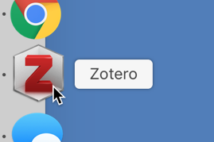

从操作系统的任务栏/程序面板打开 Zotero。

### Zotero 是做什么的?

Zotero 是一个文献管理软件。它旨在存储、管理和引用参考书目，例如书籍和文章。在 Zotero 中，这些引用中的每一个都构成一个条目。更广泛地说，Zotero 是收集和组织研究信息和资源的强大工具。

### 有何种类型的条目?

每个条目都包含不同的元数据，具体取决于它的类型。条目可以是从书籍、文章和报告到网页、艺术品、电影、信件、手稿、录音、账单、案例或法规等的所有内容。

### 关于条目信息

条目出现在 Zotero 的中间区域。当前选中条目的元数据显示在右侧窗格，包括标题、创作者、出版商、日期、页码以及引用该条目所需的任何其他数据。

## 管理文献

### 文献分类

[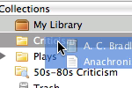](https://www.zotero.org/support/collections_and_tags#collections)

左侧窗格的 `我的文库` 中包含个人账户下的的所有条目。右键单击 `我的文库` 或单击 新建分类 按钮（在左窗格上方）创建一个新分类，即一个用于收纳文献条目的文件夹，其中可以放置特定主题相关的条目。将分类想象为音乐播放器中的播放列表：分类中的条目是文库中条目的一个“链接”。同一条目可以同时属于多个分类。

### 标签

可以为条目分配 [标签](https://www.zotero.org/support/collections_and_tags#tags)。标签由用户命名。可以根据需要为条目分配任意数量的标签。使用左侧窗格底部的标签选择器或通过右侧窗格中任何条目的标签选项卡添加或删除标签。最多可以为 6 个标签分配**颜色**。彩色标签在条目列表中显示，并且可以使用键盘上的数字键快速添加或删除。

### 搜索

[快速搜索](https://www.zotero.org/support/searching) 显示元数据、标签或全文内容与搜索词匹配的条目。单击搜索框左侧的放大镜图标将打开“高级搜索”窗口，允许进行更复杂或更具体的搜索。

### 保存的搜索

[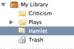](https://www.zotero.org/support/searching)

[高级搜索](https://www.zotero.org/support/searching) 可以保存在左窗格中。看起来类似于上面所说的分类，但其中的条目会根据搜索条件自动更新。

## 收集文献

### 附件

[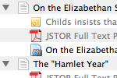](https://www.zotero.org/support/attaching_files)

每个条目可以附有笔记、文件和链接。这些 [附件](https://www.zotero.org/support/attaching_files) 显示在其父项下方。通过单击其父项旁边的箭头，可以显示或隐藏附件。要全部显示或隐藏，快捷键为 + 与 -。

### 笔记

[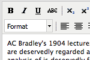](https://www.zotero.org/support/notes)

富文本 [笔记](https://www.zotero.org/support/notes) 可以附加到任何条目。可以在右侧窗格或独立窗口中进行编辑。单击工具栏中的新建笔记按钮 (以创建笔记。

### 文件

任何类型的文件都可以 [附加](https://www.zotero.org/support/attaching_files) 到条目上。使用 Zotero 工具栏中的添加附件（回形针）按钮，通过右键单击现有条目或拖放来附加文件。或者，文件不需要附加到现有条目。它们可以直接添加到您的库中。[当您使用浏览器中](https://www.zotero.org/support/quick_start_guide#capturing_items) 的 Zotero 连接器导入条目时，也可以自动下载文件。

### 链接和快照

[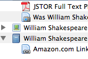](https://www.zotero.org/support/attaching_files#web_snapshots)

[网页](https://www.zotero.org/support/attaching_files#web_snapshots) 可以作为链接或快照附加到任何条目。Zotero 可以保存网页的快照，快照是网页的本地存储副本，其状态与保存时相同。无需互联网连接即可使用快照。

### 抓取条目

使用适用于 Chrome、Firefox 或 Safari 的 Zotero 连接器，可以轻松地从 Internet 上的可用信息 [创建新条目](https://www.zotero.org/support/getting_stuff_into_your_library)。通过单击按钮，Zotero 可以自动创建适当类型的条目并填充元数据字段，下载全文 PDF（如果可用），并附加有用的链接（例如，到 PubMed 条目）或补充数据文件。

### 单个或多个抓取

[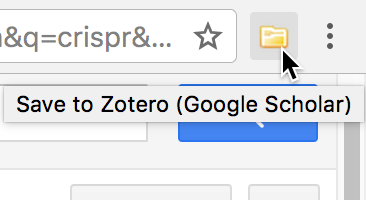](https://www.zotero.org/support/getting_stuff_into_your_library)

如果 [保存图标](https://www.zotero.org/support/adding_items_to_zotero) 是书籍、文章、图像或其他单个条目，单击它将将该条目添加到 Zotero 中的当前收藏。如果保存图标是文件夹，则网页包含多个条目。单击它将打开一个对话框，从中可以选择条目并将其保存到 Zotero。

### 转换器 Translator（旧称翻译器）

[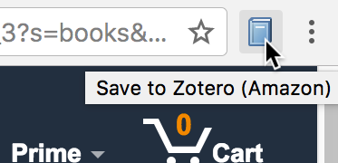](https://www.zotero.org/translators)

Zotero 使用称为 [转换器](https://www.zotero.org/translators) 的代码来识别网页上的信息。如果您使用的网站没有支持，请随时在 [Zotero 论坛](https://www.zotero.org/forum) 上请求。

### 保存网页

如果 Zotero 连接器无法识别页面上的数据，您仍然可以单击浏览器工具栏中的保存按钮将页面保存为带有附加快照的 [网页条目。](https://www.zotero.org/support/attaching_files#web_snapshots) 虽然这将保存基本元数据（标题、URL、访问日期），但您可能需要从页面手动填写其他元数据。

### 通过标识符添加条目

Zotero 可以使用 ISBN 号、数字对象标识符 (DOI) 或 PubMed ID[自动添加条目。](https://www.zotero.org/support/adding_items_to_zotero#add_item_by_identifier) 这可以通过单击 Zotero 工具栏中的按标识符添加条目按钮 ()，输入标识符，然后单击确定来完成。您甚至可以一次粘贴或输入（按 Shift+Enter 以获得更大的框）此类标识符的列表。

### 订阅

从您最喜欢的期刊或网站订阅 [RSS 提要](https://www.zotero.org/support/feeds)，以了解最新研究。转到文章网页或单击按钮将条目保存到您的图书馆。

### 手动添加条目

[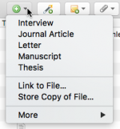](https://www.zotero.org/support/adding_items_to_zotero#manually_adding_items)

可以通过单击 Zotero 工具栏中的新条目绿色按钮 () 并选择适当的条目类型来 [手动添加条目。](https://www.zotero.org/support/adding_items_to_zotero#manually_adding_items) 然后可以在右侧窗格中手动添加元数据。虽然您通常不应该手动添加条目，但它对于添加在线不可用的文档很有用。

## 引用

### 引用条目

[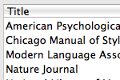](https://www.zotero.org/styles)

Zotero 使用引文样式语言 (CSL) 来正确格式化许多不同书目 [样式](https://www.zotero.org/styles) 的引文。Zotero 支持所有主要风格（Chicago, MLA, APA, Vancouver 等）以及超过 8,000 种期刊和出版商的特定风格。

### Word 集成

Zotero 的 Word、LibreOffice 和 Google Docs 插件允许用户直接从他们的文字处理软件 [插入引文。](https://www.zotero.org/support/word_processor_integration) 这使得引用多个页面或来源或以其他方式自定义引用变得轻而易举。支持文本内引用、脚注和尾注。借助 [社区开发的插件](https://www.zotero.org/support/plugins#latex_tex_and_plain_text_editors)，Zotero 还可以与 LaTeX、Scrivener 和许多其他写作程序一起使用。

### 自动参考书目

[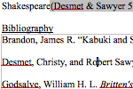](https://www.zotero.org/support/word_processor_plugin_usage)

使用 [文字处理器插件](https://www.zotero.org/support/word_processor_plugin_usage) 可以从引用的条目自动生成参考书目，并通过单击按钮切换整个文档的引用样式。

### 手动引文

Zotero 还可以将 [引文和参考书目](https://www.zotero.org/support/creating_bibliographies) 插入到任何文本字段或程序中。只需拖放条目，使用快速复制将引文发送到剪贴板，或将它们直接导出到文件。

## 合作

### 同步

通过 [Zotero 同步](https://www.zotero.org/support/sync) 在多台计算机上使用 Zotero 。图书馆条目和笔记通过 Zotero 服务器同步（无限存储），而附件同步可以使用 Zotero 服务器或您自己的 WebDAV 服务来同步文件，例如 PDF、图像或音频/视频。

### Zotero Servers

同步到 Zotero 服务器的条目可以通过您的 [zotero.org](https://www.zotero.org/) 帐户在线访问。与他人共享您的图书馆或从选定的条目创建自定义简历。

[使用 My Publications](https://www.zotero.org/support/my_publications) 为读者、公众和其他研究人员在 [zotero.org](https://www.zotero.org/) 上随时提供您的研究副本。

### 团队

Zotero 用户可以创建协作或 [组](https://www.zotero.org/support/groups)。共享组库使在线和通过 Zotero 客户端协作管理研究资源和材料成为可能。[Zotero.org](https://www.zotero.org/) 可以成为您所有条目组的研究、交流和组织的中心。
